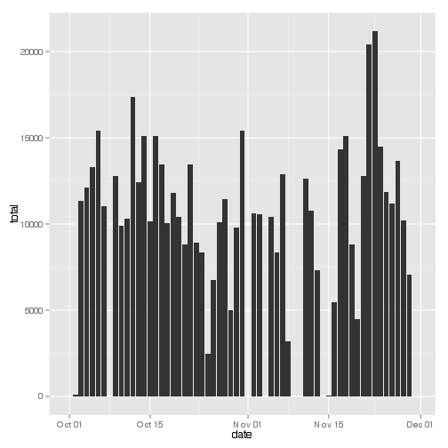
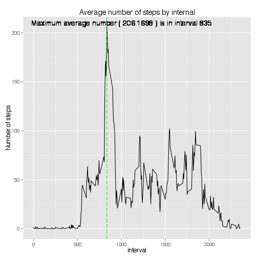
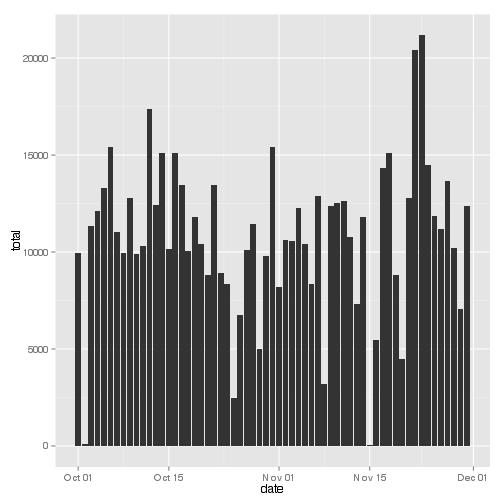
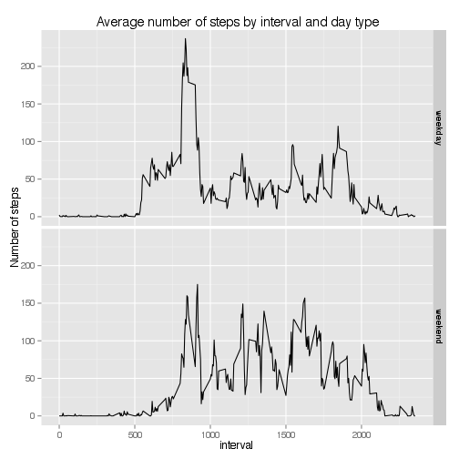

# Project scope

This project is designed as an assignment for Coursera's Reproducible research course. Its aim is to demonstrate the use of R markdown by creating this single R markdown document that can be processed by knitr and be transformed into an HTML file.

In this document, we provide of answers to a series of questions based on  data from a personal activity monitoring device. This device collects data at 5 minute intervals through out the day. The data consists of two months of data from an anonymous individual collected during the months of October and November, 2012 and include the number of steps taken in 5 minute intervals each day.

The following section describes the various steps required in the assignment to answer the questions about the date. The R code and results are provided.

# Personal activity monitoring Q&A

## Step 1:  Loading and preprocessing the data

1. Download and extract the activity.csv file only if it does not exist yet


```r
if(!file.exists("activity.zip")){
    download.file("https://d396qusza40orc.cloudfront.net/repdata%2Fdata%2Factivity.zip",destfile="activity.zip",method="curl")
}
unzip("activity.zip",exdir=".")
```

2. Load the dataset in the activity variable


```r
activity <- read.csv("activity.csv")
```


3. Data cleaning: 
convert the date to Date class

```r
activity$date <- as.Date(activity$date,format="%Y-%m-%d")
```

## Step 2: What is mean total number of steps taken per day?
1. Histogram of total number of steps taken each day

First we need to calculate the total number of steps for each day. `na.rm=TRUE` replaces missing values with 0 in the summarise step. This is done to avoid "missing values" messages when drawing the plot


```r
library(dplyr)
bydate <- activity %>% 
    group_by(date) %>%
    summarise(total=sum(steps,na.rm=TRUE))
```
 
The following histogram answers the question about the total number of steps taken each day


```r
library(ggplot2)
ggplot(bydate,aes(x=date,y=total))+
  geom_bar(stat="identity")
```

 

2. Calculate and report the mean and median total number of steps taken per day

We calculate the mean and median with two ways of "ignoring" the NA values of the data set: 

* `meanSteps` and `medianSteps` deal with the case when days without any steps are given 0 values
* `meanWithoutZeroDays` and `medianWithoutZeroDays` calculate the averages when those days are removed


```r
meanSteps <- mean(bydate$total)
meanWithoutZeroDays <- mean(bydate$total[bydate$total!=0])
medianSteps <- median(bydate$total)
medianWithoutZeroDays <- median(bydate$total[bydate$total!=0])
```

The median is 10395 if we consider 0-values days, which is close to the median when we remove those days, which is 10765

Interestingly, if we remove the days with 0 steps due to missing values, we get a mean close to the median: 10766.19 instead of 9354.23 when those days bring the total down.


## Step 3: What is the average daily activity pattern?

To find insights on the average daily activity pattern, we first create a time series plot (i.e. type = "l") of the 5-minute interval (x-axis) and the average number of steps taken, averaged across all days (y-axis)

First, we group the activiy data frame by interval and calculate the mean for each interval


```r
byinterval <- activity %>%
  group_by(interval) %>%
  summarise(avg=mean(steps,na.rm=TRUE))
```

The second question is : Which 5-minute interval, on average across all the days in the dataset, contains the maximum number of steps?


```r
maxInterval <- byinterval$interval[which.max(byinterval$avg)]
maxAvgValue <- byinterval$avg[byinterval$interval==maxInterval]
maxInterval
```

```
## [1] 835
```

We plot the answer to both questions in a single graph. A vertical line points out the interval with the maximum number of steps


```r
ggplot(byinterval,aes(x=interval,y=avg))+
    geom_line()+
    geom_vline(xintercept = maxInterval, colour="green", linetype = "longdash") +
    geom_text(data = NULL, x= 1000,  y = 210, label = paste("Maximum average number (",format(maxAvgValue,nsmall=2),") is in interval",maxInterval))+
    labs(title="Average number of steps by internal", y="Number of steps")
```

 


## Step 4: Imputing missing values

1. First, we calculate and report the total number of missing values in the dataset (i.e. the total number of rows with NAs)


```r
table(complete.cases(activity))
```

```
## 
## FALSE  TRUE 
##  2304 15264
```
We can see that we have 2304 rows with a missing value


2. Then, we devise a strategy for filling in all of the missing values in the dataset. 

First we check if the missing values are spread amongst all weekdays or if a particular day is mostly missing


```r
#make sure labels are in english on Ubuntu
Sys.setlocale("LC_TIME", "en_US.UTF-8")
```

```
## [1] "en_US.UTF-8"
```

```r
table(weekdays(activity[complete.cases(activity)==FALSE,]$date))
```

```
## 
##    Friday    Monday  Saturday    Sunday  Thursday Wednesday 
##       576       576       288       288       288       288
```

This shows that it is not just a particular day that is missing data. Since data variations amount mostly to the weekday and interval, we choose the following strategy: for each NA value, we input the corresponding interval and weekday mean.

3.  Create a new dataset that is equal to the original dataset but with the missing data filled in.

First we add a weekday attribute to our activity dataframe


```r
activity$weekday <- factor(weekdays(activity$date),levels=c("Sunday","Monday","Tuesday","Wednesday","Thursday","Friday","Saturday"))
```

Then we calculate the mean for each day/interval

```r
meanByIntervalAndWeek <- activity %>%
    group_by(interval,weekday) %>%
    summarise(meanSteps=mean(steps,na.rm=TRUE))
```

Finally we join both tables and replace the NA values in the steps columns with the values from the meanSteps columns. We remove the meanSteps column to respect the "new dataset that is equal to the original dataset" demand.


```r
# use dplyr's left_join to join by weekday and interval
filledActivity <- left_join(activity,meanByIntervalAndWeek,by=c("weekday","interval"))
# replace NA's with the mean value for the row's weekday and interval
filledActivity[is.na(filledActivity$steps),]$steps=filledActivity[is.na(filledActivity$steps),]$meanSteps
# drop the meanSteps and weekday columns in the new dataframe
filledActivity <- subset(filledActivity, select = c(-meanSteps,-weekday))
```


4.  Make a histogram of the total number of steps taken each day and Calculate and report the mean and median total number of steps taken per day. Do these values differ from the estimates from the first part of the assignment? What is the impact of imputing missing data on the estimates of the total daily number of steps?

First we draw the histogram, using the same method as question 1, where the original `activity` dataframe is replaced by our `filledActivity` dataframe.


```r
filledByDate <- filledActivity %>% 
    group_by(date) %>%
    summarise(total=sum(steps,na.rm=TRUE))
ggplot(filledByDate,aes(x=date,y=total))+
  geom_bar(stat="identity")
```

 

Then we calculate the mean and median


```r
meanFilledSteps <- mean(filledByDate$total)
medianFilledSteps <- median(filledByDate$total)
```

* For the mean, we get 10821.21 instead of 9354.23
* For the median, we get 11015 instead of  10395

Filling missing values increase both, since they are no longer considered as zero values

## Step 5: Are there differences in activity patterns between weekdays and weekends?

First we add a column to the dataframe to indicate if we have a weekcday or a weekend day

```r
weekDays <- c('Monday', 'Tuesday', 'Wednesday', 'Thursday', 'Friday')
filledActivity$dayType <- factor(weekdays(filledActivity$date) %in% weekDays,levels=c(TRUE,FALSE),labels=c("weekday","weekend"))
```

Then, we group the activiy data frame by interval and day type and calculate the mean for each interval


```r
byIntervalAndType <- filledActivity %>%
  group_by(interval, dayType) %>%
  summarise(avg=mean(steps,na.rm=TRUE))
```

Then we plot both diagrams using ggplot2 facets


```r
ggplot(byIntervalAndType,aes(x=interval,y=avg))+
    geom_line()+
    facet_grid(dayType ~ .)+
    labs(title="Average number of steps by interval and day type", y="Number of steps")
```

 
